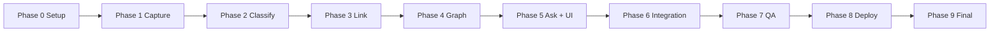

# SecondSelf — Phase-Wise Implementation Plan

This document translates [architecture.md](./architecture.md) and [problemstatement.md](./problemstatement.md) into actionable phases. Each phase has goals, tasks, files to create, commands to run, and a checklist before moving on.

---

## Overview

| Phase | Name | Maps To | Duration (est.) |
|-------|------|---------|-----------------|
| **0** | Project Setup | Foundation | 1–2 hours |
| **1** | Capture Pipeline | Week 1 — The Archivist | 2–4 hours |
| **2** | Auto-Classification | Week 2.1 — The Sorting Hat | 3–5 hours |
| **3** | Auto-Linking | Week 2.2 — Connect the Dots | 3–5 hours |
| **4** | Graph Builder & Viz | Week 3 — The Cartographer | 4–6 hours |
| **5** | RAG + Streamlit UI | Week 4 — The Oracle | 5–8 hours |
| **6** | Local Integration Test | End-to-end locally | 2–3 hours |
| **7** | Local Edge & QA Test | Real-data validation | 2–3 hours |
| **8** | Deploy to Cloud | Streamlit Cloud / HF Spaces | 2–4 hours |
| **9** | Final Verification | Public URL + README | 1–2 hours |



---

## Phase 0 — Project Setup

**Goal:** Scaffold the repo, install dependencies, configure environment. No feature code yet.

### Tasks

1. **Create project directory and folder structure**
   ```
   secondself/
   ├── raw/
   ├── wiki/
   │   ├── Projects/
   │   ├── Areas/
   │   ├── Resources/
   │   └── Archives/
   ├── data/
   └── (Python files added in later phases)
   ```

2. **Initialize Python environment**
   ```bash
   cd secondself
   python -m venv venv
   # Windows
   venv\Scripts\activate
   # macOS/Linux
   source venv/bin/activate
   pip install --upgrade pip
   ```

3. **Create `requirements.txt`**
   ```
   groq
   sentence-transformers
   numpy
   scikit-learn
   python-frontmatter
   streamlit
   python-dotenv
   requests
   pypdf
   ```

4. **Install dependencies**
   ```bash
   pip install -r requirements.txt
   ```

5. **Create `config.py`** — shared paths and constants (see architecture §8)

6. **Create `.env.example`**
   ```
   GROQ_API_KEY=your_groq_api_key_here
   ```

7. **Create `.gitignore`**
   ```
   venv/
   .env
   __pycache__/
   *.pyc
   .DS_Store
   data/embeddings.pkl
   ```

8. **Sign up for Groq API** at [console.groq.com](https://console.groq.com) and copy API key into `.env`

9. **Initialize git repo** (optional but required before deployment)
   ```bash
   git init
   git add .
   git commit -m "Phase 0: project scaffold"
   ```

### Deliverables

- [ ] `raw/`, `wiki/`, `data/` directories exist
- [ ] `requirements.txt`, `config.py`, `.env.example`, `.gitignore` created
- [ ] Virtual env active; all packages install without error
- [ ] `GROQ_API_KEY` set in local `.env`

### Exit Criteria

Run `python -c "import groq, streamlit, sentence_transformers; print('OK')"` — must print `OK`.

---

## Phase 1 — Capture Pipeline (Week 1)

**Goal:** One CLI command captures notes, links, and files into `raw/` with timestamp + unique ID.

**Badge:** 🏅 The Archivist

### Tasks

1. **Implement `capture.py`**
   - `generate_capture_id()` → returns `(timestamp_str, short_uuid)` e.g. `20250720_143022_a1b2c3`
   - `capture_note(text: str) -> str` → writes to `raw/{id}/`
   - `capture_link(url: str) -> str` → saves URL in `content.txt`
   - `capture_file(path: str) -> str` → copies file into capture folder
   - Each capture folder contains:
     - `meta.json` (id, timestamp, type, source, original_filename if file)
     - `content.txt` or copied binary file

2. **Add CLI with `argparse`**
   ```bash
   python capture.py note "My idea about building a RAG system"
   python capture.py link "https://python.langchain.com/docs/"
   python capture.py file "C:\Users\me\Documents\resume.pdf"
   ```

3. **Add input validation**
   - Reject empty notes
   - Validate URL format for links
   - Check file exists and is readable for file captures
   - Print capture ID and full path on success

4. **Capture 10+ real items** from your own scattered notes (not dummy data):
   - At least 4 text notes
   - At least 3 links/bookmarks
   - At least 3 files (PDF, image, or doc)

### Files Created

| File | Purpose |
|------|---------|
| `capture.py` | CLI + capture functions |
| `raw/{id}/meta.json` | Metadata per capture |
| `raw/{id}/content.*` | Raw content |

### Test Commands

```bash
python capture.py note "Learning plan for Masai Week 1 project"
python capture.py link "https://groq.com"
python capture.py file "./some-real-file.pdf"
dir raw   # or ls raw — verify 10+ folders
```

### Acceptance Checklist

- [ ] `raw/` and `wiki/` folder structure exists
- [ ] One command captures a note, a link, AND a file
- [ ] Every capture has a timestamp + unique ID in `meta.json`
- [ ] 10+ real items in `raw/` (not test data)

---

## Phase 2 — Auto-Classification (Week 2.1)

**Goal:** Send raw captures to Groq/Llama 3; get PARA category, tags, and summary; write organized wiki notes.

**Badge:** 🏅 The Librarian (part 1)

### Tasks

1. **Implement `classify.py`**
   - `extract_text(raw_path: Path) -> str` — read note/link/file content
   - `build_classify_prompt(content: str) -> str` — instruct LLM to return JSON
   - `call_llm(prompt: str) -> dict` — Groq API call with JSON parsing
   - `classify_capture(raw_path: Path) -> Path` — write `wiki/{category}/{id}.md`
   - `classify_all_unprocessed() -> list[Path]` — skip already-classified IDs

2. **Define LLM prompt** — must return:
   ```json
   {
     "category": "Projects | Areas | Resources | Archives",
     "tags": ["tag1", "tag2"],
     "summary": "One line summary",
     "title": "Optional title"
   }
   ```

3. **Write wiki markdown** with YAML frontmatter (see architecture §4.2)

4. **Add CLI**
   ```bash
   python classify.py                    # classify all unprocessed
   python classify.py --id 20250720_143022_a1b2c3
   python classify.py --dry-run          # print result, don't write
   ```

5. **Optional:** PDF text extraction with `pypdf` for file-type captures

6. **Run on all Phase 1 captures** — verify PARA folders populate

### Files Created

| File | Purpose |
|------|---------|
| `classify.py` | PARA classification pipeline |
| `wiki/{category}/{id}.md` | Organized wiki notes |

### Test Commands

```bash
python classify.py --dry-run
python classify.py
# Verify wiki/Projects/, wiki/Areas/, etc. contain .md files
```

### Acceptance Checklist

- [ ] Any raw capture → category + tags + summary automatically
- [ ] PARA categorization working (all 4 categories used appropriately)
- [ ] Re-running classify skips already-processed notes (idempotent)
- [ ] Wiki notes have valid frontmatter + body content

---

## Phase 3 — Auto-Linking (Week 2.2)

**Goal:** Compute embeddings locally; auto-link related notes when similarity exceeds threshold.

**Badge:** 🏅 The Librarian (part 2)

### Tasks

1. **Implement `link.py`**
   - `load_embedding_model()` — lazy-load `all-MiniLM-L6-v2`
   - `compute_embedding(text: str) -> np.ndarray`
   - `get_note_text(note_path: Path) -> str` — summary + tags + body
   - `load_embeddings_cache() -> dict` — from `data/embeddings.pkl`
   - `save_embeddings_cache(cache: dict) -> None`
   - `find_related(note_id: str, threshold: float) -> list[tuple[str, float]]`
   - `link_note(note_id: str) -> list[str]` — insert `[[id]]` links bidirectionally
   - `process_all_links() -> None`

2. **Linking rules**
   - Similarity threshold: `0.75` (tune between 0.70–0.80)
   - Max links per note: `5`
   - Update frontmatter `links:` array AND markdown `Related:` section

3. **Add CLI**
   ```bash
   python link.py                  # link all notes
   python link.py --id {note_id}   # link single note
   python link.py --threshold 0.78 # override threshold
   ```

4. **Capture more raw items if needed** — target **15+ total** processed wiki notes

5. **Optional: `pipeline.py`**
   ```python
   def run_classify_and_link():
       classify_all_unprocessed()
       process_all_links()
   ```

### Files Created

| File | Purpose |
|------|---------|
| `link.py` | Embeddings + auto-linking |
| `data/embeddings.pkl` | Embedding cache |
| Updated `wiki/**/*.md` | Notes with `[[links]]` |

### Test Commands

```bash
python link.py
python -c "import pickle; print(len(pickle.load(open('data/embeddings.pkl','rb'))))"
# Manually inspect 2-3 wiki notes — confirm Related links make sense
```

### Acceptance Checklist

- [ ] Embeddings computed per note
- [ ] Related notes auto-linked (no manual tagging)
- [ ] Links are bidirectional where appropriate
- [ ] 15+ real items → organized, linked `wiki/`

---

## Phase 4 — Graph Builder & Visualization (Week 3)

**Goal:** Convert wiki notes + links into `graph.json`; render interactive force-directed graph.

**Badge:** 🏅 The Cartographer

### Tasks

#### 4.1 — Graph Data Model (`build_graph.py`)

1. **Implement graph builder**
   - `parse_wiki_note(path: Path) -> dict` — extract id, label, category, tags, summary, preview
   - `extract_links_from_markdown(content: str) -> list[str]` — parse `[[note_id]]`
   - `build_graph(wiki_dir: Path) -> dict` — `{nodes: [], edges: []}`
   - `export_json(graph: dict, out_path: Path) -> None`

2. **Node fields:** id, label, category, tags, summary, content_preview, group

3. **Edge fields:** from, to, weight (optional), type (`link` or `similarity`)

4. **Add CLI**
   ```bash
   python build_graph.py
   python build_graph.py --output data/graph.json
   ```

#### 4.2 — Interactive Graph (standalone HTML or Streamlit component)

1. **Create graph HTML template** using vis-network CDN
   - Force-directed layout
   - Node colors by PARA category (Projects=blue, Areas=green, etc.)
   - Hover tooltip: summary + content preview
   - Drag, zoom, pan enabled
   - Optional CSS pulse animation on hover

2. **Test standalone** — open HTML file in browser with embedded `graph.json`

3. **Verify with real data** — graph must reflect your actual wiki, not dummy nodes

### Files Created

| File | Purpose |
|------|---------|
| `build_graph.py` | Wiki → graph.json |
| `data/graph.json` | Exported graph |
| `static/graph.html` | Standalone graph viewer (optional) |

### Test Commands

```bash
python build_graph.py
python -c "import json; g=json.load(open('data/graph.json')); print(len(g['nodes']), 'nodes', len(g['edges']), 'edges')"
# Open static/graph.html in browser OR preview in Phase 5 Streamlit app
```

### Acceptance Checklist

- [ ] Script builds nodes + edges from notes and exports clean JSON
- [ ] Every wiki note appears as a node
- [ ] Every `[[link]]` appears as an edge
- [ ] Interactive force-directed graph renders from JSON
- [ ] Hover reveals note content
- [ ] Drag + zoom work
- [ ] Built from your real notes, not dummy data

---

## Phase 5 — RAG Q&A + Streamlit UI (Week 4)

**Goal:** `ask()` function for retrieval-augmented Q&A; Streamlit app combining graph + search.

**Badge:** 🏅 The Oracle (part 1)

### Tasks

#### 5.1 — Ask Function (`ask.py`)

1. **Implement RAG pipeline**
   - `embed_query(question: str) -> np.ndarray`
   - `retrieve_relevant_notes(question: str, top_k: int = 5) -> list[dict]`
   - `build_rag_prompt(question: str, notes: list) -> str`
   - `ask(question: str) -> AskResponse` — answer + source citations

2. **RAG prompt guardrails**
   - Answer ONLY from retrieved notes
   - Cite note IDs in response
   - Say "I don't have that in your notes" when context is insufficient

3. **Add CLI for testing**
   ```bash
   python ask.py "What projects am I working on?"
   python ask.py "Summarize my notes about Python"
   ```

#### 5.2 — Streamlit App (`app.py`)

1. **Layout**
   - Header: "SecondSelf — Your Personal AI Second Brain"
   - Search bar + Ask button
   - Answer panel with source citations
   - Interactive graph (vis-network via `st.components.v1.html`)
   - Sidebar: stats (node count, edge count, raw inbox count)

2. **Wire up functions**
   - Load `data/graph.json` on startup
   - Call `ask()` on button click
   - Optional sidebar buttons: "Rebuild Graph", "Process New Captures"

3. **Run locally**
   ```bash
   streamlit run app.py
   ```

4. **Test with 5+ real questions** about your captured notes

### Files Created

| File | Purpose |
|------|---------|
| `ask.py` | RAG retrieval + LLM synthesis |
| `app.py` | Streamlit UI (graph + search) |

### Test Commands

```bash
python ask.py "What did I bookmark about AI?"
streamlit run app.py
# In browser: ask questions, hover graph nodes, drag/zoom
```

### Acceptance Checklist

- [ ] `ask()` returns answers synthesized from your own notes
- [ ] Sources/citations shown with each answer
- [ ] One Streamlit app contains both graph and search bar
- [ ] Graph and ask both work in local Streamlit session

---

## Phase 6 — Local Integration Test

**Goal:** Verify the full pipeline works end-to-end on your machine before deployment.

### Tasks

1. **Run full pipeline sequence**
   ```bash
   python capture.py note "Integration test note — delete later"
   python classify.py
   python link.py
   python build_graph.py
   python ask.py "What is the integration test note about?"
   streamlit run app.py
   ```

2. **Verify data flow**
   ```
   capture → raw/ → classify → wiki/ → link → wiki/ (updated)
   → build_graph → graph.json → app.py (graph + ask)
   ```

3. **Check idempotency**
   - Run `classify.py` twice — no duplicate wiki files
   - Run `link.py` twice — no duplicate links
   - Run `build_graph.py` twice — consistent node/edge counts

4. **Log review** — confirm no unhandled exceptions in any step

5. **Document any config tweaks** (threshold, top_k) in README draft

### Integration Test Matrix

| Step | Input | Expected Output |
|------|-------|-----------------|
| Capture note | Text string | New folder in `raw/` |
| Capture link | URL | `content.txt` with URL |
| Capture file | PDF path | File copied to `raw/` |
| Classify | Unprocessed raw | New `.md` in `wiki/{category}/` |
| Link | Wiki notes | `[[links]]` in related notes |
| Build graph | Wiki | Valid `graph.json` |
| Ask | Question | Answer + sources from your notes |
| Streamlit | Browser | Graph renders + ask works |

### Exit Criteria

- [ ] Full pipeline runs without errors
- [ ] New capture → visible in graph after classify + link + build
- [ ] Ask returns relevant answer for new capture
- [ ] All Phase 1–5 acceptance checklists still pass

---

## Phase 7 — Local Edge & QA Test

**Goal:** Stress-test with real-world scenarios before going public. (See also `edge-case.md` when created.)

### Tasks

1. **Content variety test**
   - Very short note (1 word)
   - Very long note (500+ words)
   - Duplicate/similar notes (should auto-link)
   - Unrelated notes (should NOT link)
   - Non-English content (if applicable)
   - PDF with little extractable text

2. **Ask edge cases**
   - Question with no matching notes → graceful "not found" response
   - Vague question → best-effort answer from closest notes
   - Question naming a specific tag/category

3. **Graph edge cases**
   - Single node (only 1 note) — graph still renders
   - Note with no links — orphan node visible
   - 20+ nodes — performance acceptable in browser

4. **Error handling verification**
   - Missing `GROQ_API_KEY` → clear error message
   - Empty `wiki/` → app shows helpful empty state
   - Invalid file path in capture → user-friendly error

5. **Fix any bugs found** before Phase 8

### Exit Criteria

- [ ] No crashes on empty/missing data
- [ ] Ask handles "no results" gracefully
- [ ] Graph handles 1 node and 20+ nodes
- [ ] All critical bugs from QA fixed

---

## Phase 8 — Deploy to Cloud

**Goal:** Live public URL with graph + ask working in production.

**Badge:** 🏅 The Oracle (part 2)

### Tasks

1. **Prepare repo for deployment**
   - Commit `wiki/`, `data/graph.json`, `data/embeddings.pkl` (or add startup rebuild logic)
   - Ensure `requirements.txt` is complete and pinned (optional but recommended)
   - Create `README.md` with setup instructions

2. **Push to GitHub**
   ```bash
   git add .
   git commit -m "Complete SecondSelf pipeline"
   git remote add origin https://github.com/YOUR_USER/secondself.git
   git push -u origin main
   ```

3. **Deploy to Streamlit Community Cloud**
   - Go to [share.streamlit.io](https://share.streamlit.io)
   - Connect GitHub repo
   - Set main file: `app.py`
   - Add secret: `GROQ_API_KEY` = your key
   - Deploy and wait for build

4. **Alternative: Hugging Face Spaces**
   - Create new Space (Streamlit SDK)
   - Push repo; set `GROQ_API_KEY` in Space secrets

5. **Post-deploy smoke test** on public URL
   - App loads without 500 error
   - Graph renders
   - Ask returns an answer
   - No API key exposed in page source

### Deployment Checklist

- [ ] Public GitHub repo exists
- [ ] `GROQ_API_KEY` in Streamlit/HF secrets (NOT in repo)
- [ ] App builds successfully on cloud
- [ ] Public URL accessible

---

## Phase 9 — Final Verification & Documentation

**Goal:** Confirm end-to-end flow on deployed app; finalize README; earn all badges.

### Tasks

1. **End-to-end verification on live URL**
   ```
   capture (local) → classify → link → build_graph → push → cloud app refresh
   → ask question on live URL → verify answer
   ```

2. **Write `README.md`** including:
   - Project description + screenshot/GIF
   - Architecture overview (link to `architecture.md`)
   - Setup instructions (venv, pip install, .env)
   - Usage (capture, classify, link, graph, ask commands)
   - Live demo URL
   - Tech stack
   - Weekly milestones / badges earned

3. **Final acceptance audit**

   | Milestone | Badge | Status |
   |-----------|-------|--------|
   | Capture Pipeline | 🏅 The Archivist | [ ] |
   | Self-Organizing Wiki | 🏅 The Librarian | [ ] |
   | Living Brain | 🏅 The Cartographer | [ ] |
   | SecondSelf Deployed | 🏅 The Oracle | [ ] |

4. **Final deliverables check**
   - [ ] Public GitHub repo with clean README + setup instructions
   - [ ] Live deployed URL — graph + ask both working
   - [ ] End-to-end flow verified: capture → classify → link → graph → ask
   - [ ] All 4 weekly milestones complete

### Exit Criteria

Project is **done** when all four badges are earned and the live URL demonstrates both the interactive brain graph and ask-anything search working together.

---

## Quick Reference — Command Cheat Sheet

```bash
# Phase 0
pip install -r requirements.txt

# Phase 1
python capture.py note "..."
python capture.py link "https://..."
python capture.py file "./file.pdf"

# Phase 2
python classify.py

# Phase 3
python link.py

# Phase 4
python build_graph.py

# Phase 5
python ask.py "Your question here"
streamlit run app.py

# Full pipeline (after Phase 3)
python classify.py && python link.py && python build_graph.py
```

---

## File Creation Timeline

| Phase | Files to Create/Modify |
|-------|------------------------|
| 0 | `config.py`, `requirements.txt`, `.env.example`, `.gitignore`, folders |
| 1 | `capture.py`, `raw/**/*` |
| 2 | `classify.py`, `wiki/**/*.md` |
| 3 | `link.py`, `data/embeddings.pkl` |
| 4 | `build_graph.py`, `data/graph.json`, `static/graph.html` |
| 5 | `ask.py`, `app.py` |
| 8–9 | `README.md`, GitHub repo, deployed URL |

---

## Dependencies Between Phases

```
Phase 0 ──► Phase 1 ──► Phase 2 ──► Phase 3 ──► Phase 4 ──► Phase 5
                                                              │
                                                              ▼
                                         Phase 9 ◄── Phase 8 ◄── Phase 7 ◄── Phase 6
```

**Do not skip phases.** Each week's output is the next week's input. Phase 6–7 require Phases 1–5 complete. Phase 8–9 require passing local tests.

---

## Related Documents

- [problemstatement.md](./problemstatement.md) — what we're building and weekly acceptance criteria
- [architecture.md](./architecture.md) — system design, data models, tech stack
- [edge-case.md](./edge-case.md) — corner scenarios and edge cases
