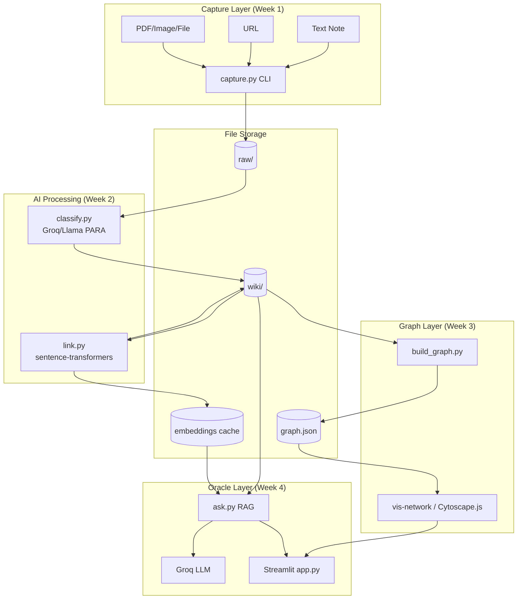
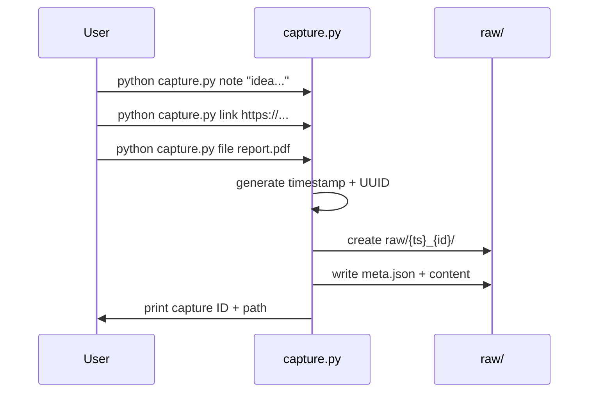
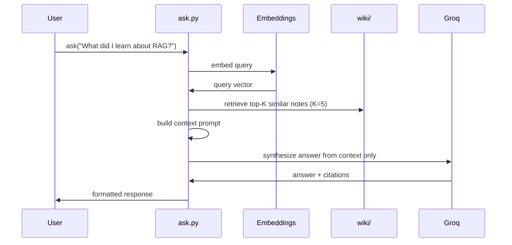
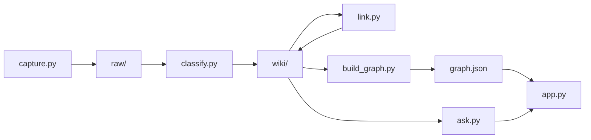
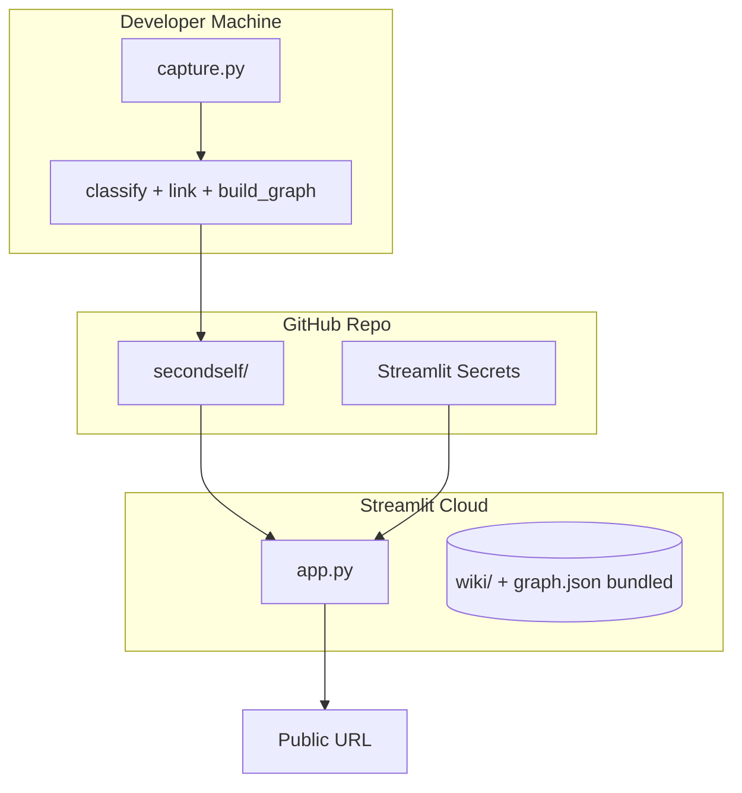

# SecondSelf — Detailed System Architecture

Architecture for an end-to-end personal knowledge system: capture → classify → link → visualize → query → deploy.

---

## 1. Vision & Design Principles

| Principle | Meaning |
|-----------|---------|
| **Capture-first** | Zero friction: one command saves anything |
| **AI organizes, human explores** | PARA + embeddings replace manual filing |
| **Graph as the mental model** | Notes are nodes; relationships are edges |
| **RAG over your data** | Answers come from *your* notes, not the LLM's training |
| **Incremental build** | Each week's output is next week's input |
| **Local-first, cloud-deployable** | Files on disk; free APIs for AI; Streamlit for public UI |

---

## 2. High-Level System Architecture



---

## 3. Repository Structure

```
secondself/
├── raw/                          # Immutable captures (Week 1)
│   └── {timestamp}_{uuid}/
│       ├── meta.json             # id, timestamp, type, source
│       └── content.*             # note.txt | url.txt | original file
│
├── wiki/                         # Processed, linked notes (Week 2+)
│   └── {para_category}/
│       └── {note_id}.md          # Frontmatter + body + [[links]]
│
├── data/
│   ├── embeddings.pkl            # {note_id: vector} cache
│   └── graph.json                # nodes + edges export (Week 3)
│
├── capture.py                    # Week 1: CLI capture
├── classify.py                   # Week 2.1: PARA + tags + summary
├── link.py                       # Week 2.2: embeddings + auto-link
├── build_graph.py                # Week 3.1: wiki → graph.json
├── ask.py                        # Week 4.1: RAG Q&A
├── app.py                        # Week 4.2: Streamlit UI
├── config.py                     # Shared config (paths, thresholds, API keys)
├── requirements.txt
├── .env.example                  # GROQ_API_KEY, etc.
└── README.md
```

---

## 4. Data Models

### 4.1 Raw Capture (`raw/{timestamp}_{uuid}/`)

```json
// meta.json
{
  "id": "20250720_143022_a1b2c3",
  "timestamp": "2025-07-20T14:30:22+05:30",
  "type": "note | link | file",
  "source": "cli",
  "original_filename": "report.pdf"
}
```

**Content storage rules:**

- **Note** → `content.txt` (plain text or markdown)
- **Link** → `content.txt` (URL + optional fetched title/snippet later)
- **File** → original binary + optional `content.txt` (extracted text for PDFs in Week 2+)

### 4.2 Wiki Note (`wiki/{category}/{note_id}.md`)

```yaml
---
id: 20250720_143022_a1b2c3
created: 2025-07-20T14:30:22+05:30
category: Projects          # PARA: Projects | Areas | Resources | Archives
tags: [python, rag, masai]
summary: "One-line AI summary"
links: [20250719_091500_x9y8z7]  # related note IDs
embedding_version: "all-MiniLM-L6-v2"
---

# Title (optional, from summary or first line)

Note body...

Related: [[20250719_091500_x9y8z7]]
```

### 4.3 Graph Export (`data/graph.json`)

```json
{
  "nodes": [
    {
      "id": "20250720_143022_a1b2c3",
      "label": "RAG pipeline notes",
      "category": "Projects",
      "tags": ["python", "rag"],
      "summary": "...",
      "content_preview": "First 200 chars...",
      "group": "Projects"
    }
  ],
  "edges": [
    {
      "from": "20250720_143022_a1b2c3",
      "to": "20250719_091500_x9y8z7",
      "weight": 0.82,
      "type": "similarity"
    }
  ]
}
```

---

## 5. Component Architecture (By Week)

### Week 1 — Capture Pipeline (`capture.py`)



**Interface:**

```python
def capture_note(text: str) -> str: ...
def capture_link(url: str) -> str: ...
def capture_file(path: str) -> str: ...
def generate_capture_id() -> tuple[str, str]:  # (timestamp, uuid)
```

**CLI design:**

```bash
python capture.py note "My idea about RAG"
python capture.py link "https://example.com/article"
python capture.py file "./documents/report.pdf"
python capture.py process-all   # optional: trigger Week 2 pipeline
```

---

### Week 2 — Self-Organizing Wiki

#### 2.1 Classification (`classify.py`)

```mermaid
flowchart LR
    RAW[Read raw capture] --> EXTRACT[Extract text]
    EXTRACT --> PROMPT[Build PARA prompt]
    PROMPT --> GROQ[Groq API / Llama 3]
    GROQ --> PARSE[Parse JSON response]
    PARSE --> WRITE[Write wiki/{category}/{id}.md]
```

**LLM prompt contract (structured output):**

```json
{
  "category": "Projects",
  "tags": ["tag1", "tag2"],
  "summary": "One line summary",
  "title": "Optional title"
}
```

**PARA categories:**

| Category | Use when |
|----------|----------|
| **Projects** | Active work with a deadline/outcome |
| **Areas** | Ongoing responsibilities |
| **Resources** | Reference material for future use |
| **Archives** | Inactive/completed items |

**Interface:**

```python
def classify_capture(raw_path: Path) -> WikiNote: ...
def classify_all_unprocessed() -> list[WikiNote]: ...
def call_llm(prompt: str) -> dict: ...
```

#### 2.2 Auto-Linking (`link.py`)

```mermaid
flowchart TB
    NEW[New wiki note] --> EMB1[Compute embedding]
    EXISTING[All wiki notes] --> EMB2[Load/compute embeddings]
    EMB1 --> SIM[Cosine similarity matrix]
    EMB2 --> SIM
    SIM --> THRESH{similarity >= 0.75?}
    THRESH -->|yes| LINK[Insert bidirectional [[links]]]
    THRESH -->|no| SKIP[Skip]
    LINK --> CACHE[Update embeddings.pkl]
```

**Key decisions:**

- Model: `sentence-transformers/all-MiniLM-L6-v2` (local, free, ~80MB)
- Similarity threshold: **0.70–0.80** (tune on real data)
- Top-K links: max **5** per note to avoid graph clutter
- Embeddings computed on: `summary + tags + body` (weighted concatenation)

**Interface:**

```python
def compute_embedding(text: str) -> np.ndarray: ...
def find_related(note_id: str, threshold: float = 0.75) -> list[tuple[str, float]]: ...
def link_note(note_id: str) -> list[str]: ...
def process_all_links() -> None: ...
```

---

### Week 3 — Living Brain Graph

#### 3.1 Graph Builder (`build_graph.py`)

```python
def parse_wiki_note(path: Path) -> Node: ...
def extract_links_from_markdown(content: str) -> list[str]: ...
def build_graph(wiki_dir: Path) -> Graph: ...
def export_json(graph: Graph, out_path: Path) -> None: ...
```

**Graph logic:**

- Every wiki note → **node**
- Every `[[note_id]]` or frontmatter `links` entry → **edge**
- Optional: similarity-only edges (from link.py) with `type: "similarity"`

#### 3.2 Interactive Visualization (inside `app.py` or `static/`)

**Recommended: vis-network** (simpler Streamlit integration via `streamlit-components` or `st.components.v1.html`)

| Feature | Implementation |
|---------|----------------|
| Force-directed layout | vis-network physics engine |
| Node color by PARA | `group` field → color map |
| Hover popup | `title` / custom tooltip with summary + preview |
| Drag + zoom | Built-in vis-network |
| "Pulse" effect | CSS animation on selected/hovered nodes |

---

### Week 4 — Oracle (RAG + Deployment)

#### 4.1 Ask Function (`ask.py`)



**RAG pipeline:**

```python
def embed_query(question: str) -> np.ndarray: ...
def retrieve_relevant_notes(question: str, top_k: int = 5) -> list[WikiNote]: ...
def build_rag_prompt(question: str, notes: list[WikiNote]) -> str: ...
def ask(question: str) -> AskResponse: ...
```

**AskResponse shape:**

```python
@dataclass
class AskResponse:
    answer: str
    sources: list[dict]  # [{id, summary, similarity, path}]
    confidence: str      # optional heuristic
```

**Prompt guardrails:**

- "Answer ONLY from the provided notes"
- "If not found, say you don't have that information"
- Include note IDs in citations for traceability

#### 4.2 Streamlit App (`app.py`)

```
┌─────────────────────────────────────────────────────────┐
│  SecondSelf — Your Personal AI Second Brain             │
├─────────────────────────────────────────────────────────┤
│  [🔍 Ask anything about your notes...        ] [Ask]    │
│                                                         │
│  Answer panel (with source citations)                   │
├─────────────────────────────────────────────────────────┤
│  Interactive Knowledge Graph (vis-network iframe)       │
│  [drag · zoom · hover for note preview]                 │
├─────────────────────────────────────────────────────────┤
│  Sidebar: Stats | Re-run classify | Rebuild graph       │
└─────────────────────────────────────────────────────────┘
```

**Pages/tabs (optional):**

1. **Brain** — graph + ask (main)
2. **Capture** — text input to run capture from UI
3. **Inbox** — unprocessed raw/ items count

---

## 6. End-to-End Pipeline Orchestration



**Master script (optional `pipeline.py`):**

```python
def run_full_pipeline():
    classify_all_unprocessed()
    process_all_links()
    build_graph()
```

---

## 7. Technology Stack

| Layer | Technology | Rationale |
|-------|------------|-----------|
| Language | Python 3.10+ | Course stack, rich AI ecosystem |
| Capture CLI | `argparse` / `click` | Simple one-command interface |
| LLM | Groq + Llama 3 | Free tier, fast inference |
| Embeddings | `sentence-transformers` | Local, no API cost |
| Vector ops | `numpy` / `scikit-learn` | Cosine similarity |
| Markdown | `python-frontmatter` | Wiki note parsing |
| Graph viz | vis-network (JS) | Force-directed, hover, zoom |
| UI | Streamlit | Rapid full-stack UI |
| Deploy | Streamlit Community Cloud | Free public URL |
| Secrets | `.env` + Streamlit secrets | API keys |

**`requirements.txt` (baseline):**

```
groq
sentence-transformers
numpy
scikit-learn
python-frontmatter
streamlit
python-dotenv
requests
pypdf
```

---

## 8. Configuration (`config.py`)

```python
RAW_DIR = Path("raw")
WIKI_DIR = Path("wiki")
DATA_DIR = Path("data")
GRAPH_PATH = DATA_DIR / "graph.json"
EMBEDDINGS_PATH = DATA_DIR / "embeddings.pkl"

SIMILARITY_THRESHOLD = 0.75
MAX_LINKS_PER_NOTE = 5
RAG_TOP_K = 5
EMBEDDING_MODEL = "all-MiniLM-L6-v2"
LLM_MODEL = "llama3-8b-8192"
```

---

## 9. Deployment Architecture



**Deployment notes:**

- Commit `wiki/`, `data/graph.json`, and `data/embeddings.pkl` (or rebuild on startup)
- Set `GROQ_API_KEY` in Streamlit secrets
- For large embedding models: pre-compute embeddings locally; ship pickle to cloud
- `packages.txt` if needed for system deps on Streamlit Cloud

---

## 10. Security & Privacy

| Concern | Mitigation |
|---------|------------|
| API keys in repo | `.env` + `.gitignore`; Streamlit secrets in prod |
| Personal notes public | Deploy demo with sanitized notes OR password-protect Streamlit |
| LLM sends note content | Use Groq; be aware data leaves your machine |
| File uploads | Validate extensions; size limits in capture.py |

---

## 11. Observability & Debugging

- **Logging:** stdlib `logging` in each module (`INFO` for pipeline steps, `DEBUG` for similarity scores)
- **Idempotency:** classify skips already-processed raw IDs (track in wiki frontmatter)
- **Dry-run mode:** `classify.py --dry-run` prints PARA without writing
- **Stats endpoint in app:** node count, edge count, last processed timestamp

---

## 12. Week-to-Week Dependency Map

| Week | Delivers | Depends On | Enables |
|------|----------|------------|---------|
| 1 | `raw/` + `capture.py` | — | Week 2 input |
| 2 | `wiki/` + classify + link | Week 1 raw/ | Week 3 graph |
| 3 | `graph.json` + viz | Week 2 wiki/ | Week 4 UI |
| 4 | `ask.py` + Streamlit + URL | Weeks 1–3 | Final product |

---

## 13. Acceptance Criteria Traceability

| Criterion | Architecture Component |
|-----------|------------------------|
| One command captures note/link/file | `capture.py` CLI |
| Timestamp + unique ID | `meta.json` in `raw/{ts}_{id}/` |
| PARA auto-classification | `classify.py` + Groq |
| Embeddings + auto-link | `link.py` + `embeddings.pkl` |
| Graph JSON export | `build_graph.py` |
| Interactive graph | vis-network in `app.py` |
| RAG Q&A | `ask.py` |
| Public URL | Streamlit Cloud deploy |

---

## 14. Future Extensions (Post–Week 4)

- URL content fetching (BeautifulSoup) at capture time
- PDF/image OCR for richer embeddings
- ChromaDB/FAISS instead of pickle for scale
- Web capture UI (browser extension)
- Multi-user auth if moving beyond personal brain
